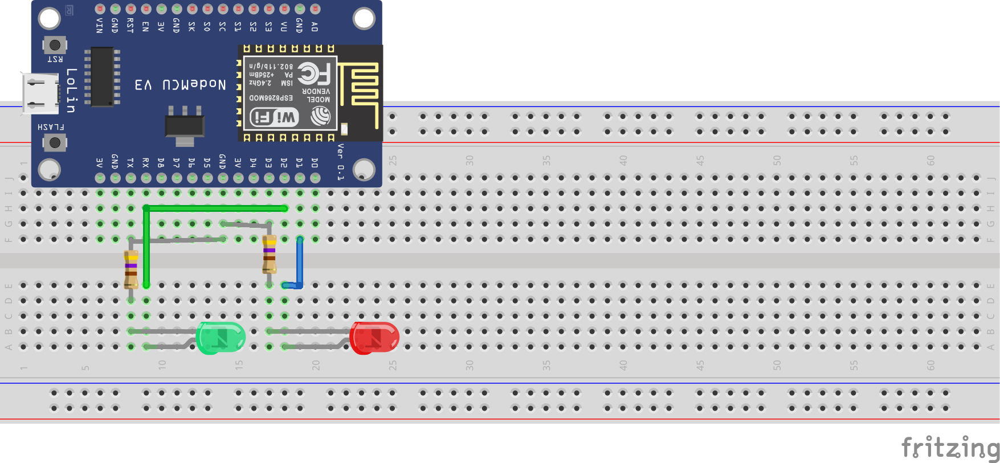

# Traffic light

## Setup


The resistors have a resistance of 470Ω.

Create a file called `data/Config.json`. It should look like this:

```json
{
  "ssid": "the ssid",
  "password": "the psk",
  "mqttAddress": "the ip",
  "mqttPort": 1883,
  "mqttUser": "the user",
  "mqttPassword": "the users password",
  "mqttTopic": "the topic you want to connect to",
  "mqttClientName": "The client name"
}
```

To upload your config file run `Upload Filesystem Image` from VScode or 
```json
pio run -e debug -t uploadfs
```
or
```json
pio run -e release -t uploadfs
```
depending on the environment you used.

## Messaging
Messages have the form:
```json
{ "command": "RED" }
```
or
```json
{ "command": "GREEN" }
```
or
```json
{ "command": "OFF" }
```